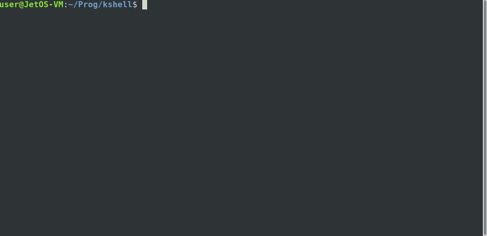

# KShell

Command line shell developed as an assignment for Operating Systems MSU MMXVI
course. Designed for running in Linux environment and pretends to be
POSIX-compliant.



## Requirements

Please look for
[Task.pdf](https://github.com/kostmetallist/kshell/blob/master/doc/Task.pdf).

## Prerequisites

The shell uses standard C library and a few POSIX-specific headers/constants.
Any popular Linux distribution should be capable of launching the shell out of
the box.

## How to compile and run

```bash
make
./OUT
```
